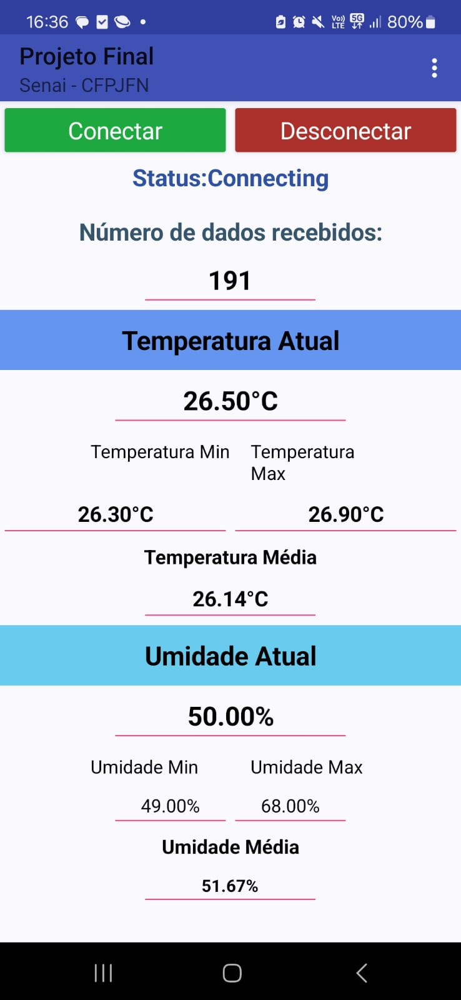

<h1 align="center"> 
    <p>Análise e Processamento de Dados MQTT</p>
</h1>

## 📚Sobre
Este repositório é o resultado de um trabalho em dupla realizado durante nosso curso no Senai, comigo fazendo a parte dos cálculos no código e organizando tudo no Broker MQTT que foi o Shiftr, já meu amigo ficou com a parte de montar os circuitos físicos do projeto, fez a lógica dos led´s e desenvolveu e personalizou o aplicativo. Ele demonstra nossa habilidade em desenvolver aplicações IoT úteis e interessantes para diversos contextos.

Fique à vontade para explorar o código-fonte e contribuir com melhorias. Estamos abertos a sugestões e colaborações que possam aprimorar ainda mais este projeto.

## 💻Funcionalidades
O código contém uma interface de visualização de dados em um aplicativo. Ele faz as leituras de temperatura e umidade utilizando um sensor DHT11. Esses dados de temperatura e umidade são enviados para um broker MQTT e podem ser resgatados por algum inscrito no tópico, a ideia é de uma empresa ou instituição utilizar a aplicação para ter controle da temperatura e umidade de uma sala, mas não se prende a isso, podendo facilmente ser alterado para utiliza-lo em outros contextos. Suas funcionalidades principais são: 
- Processamento de Dados
    - Temperatura atual
    - Umidade atual
    - Número de dados recebidos
    - Temperatura Média
    - Umidade média
    - Temperatura máxima
    - Umidade máxima
    - Temperatura mínima
    - Umidade mínima
- Aplicativo Móvel
    - Possibilita a visualização de todos os dados do Broker MQTT
- Esquema de Led´s no circuito
    - Um LED sinaliza a conexão do ESP32 com a rede Wi-Fi (O LED permanece ligado enquanto estiver conectado). 
    - Um LED sinalize sempre que uma publicação for feita (LED pisca quando for feita uma publicação).
    - Um LED sinalize sempre que uma mensagem de um tópico assinado chegar. 

 Toda a lógica de média, número de dados enviados e etc, está no próprio código que é inserido no ESP32 por meio do arduino IDE, o código também possibilita facilmente a visualização dos dados em um aplicativo de dashboard desktop como Node-RED.

### Vídeo do código em execução
[Assista ao vídeo](https://www.youtube.com/watch?v=iiaZknPVKpI)

Abaixo, uma foto do aplicativo funcionando recebendo os dados do Broker e imprimindo na tela:


## 🔨Ferramentas

- [ESP32](https://www.espressif.com/en/products/socs/esp32)
- [Arduino IDE](https://www.arduino.cc)
- [Shiftr](https://www.shiftr.io)

## 👨🏾‍🏫Requisitos de Pré-instalação

- Circuito com ESP32
- Shiftr (ou outro broker compatível)
- Arduino IDE (ou outra IDE compatível)
- Placa ESP32 DEVKIT V1

## 🏹Instalação

1. Clone este repositório:

```bash
    $ git clone https://github.com/natan3LiR/Processamento-de-Dados-Sensor--MQTT.git
```
2. Entre no diretório
```bash
    $ Processamento-de-Dados-Sensor--MQTT
```
